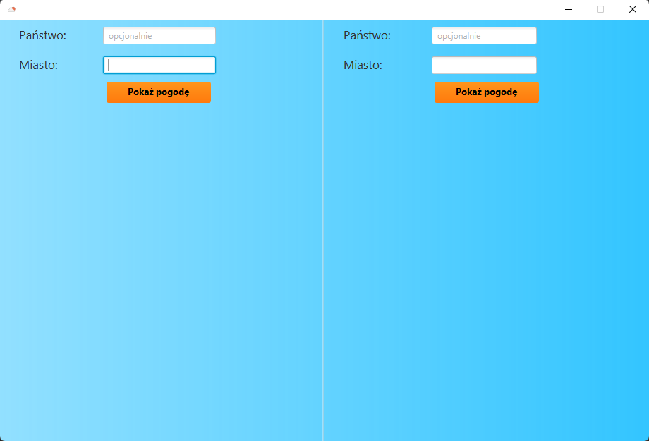
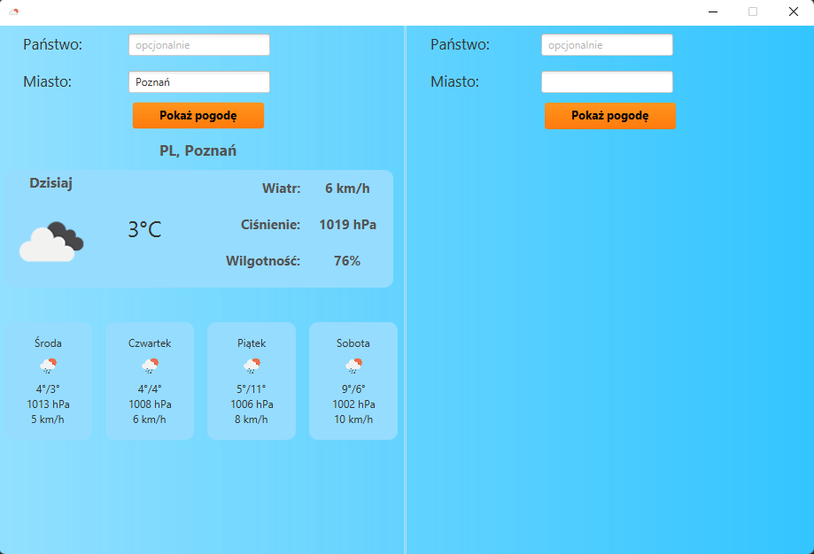
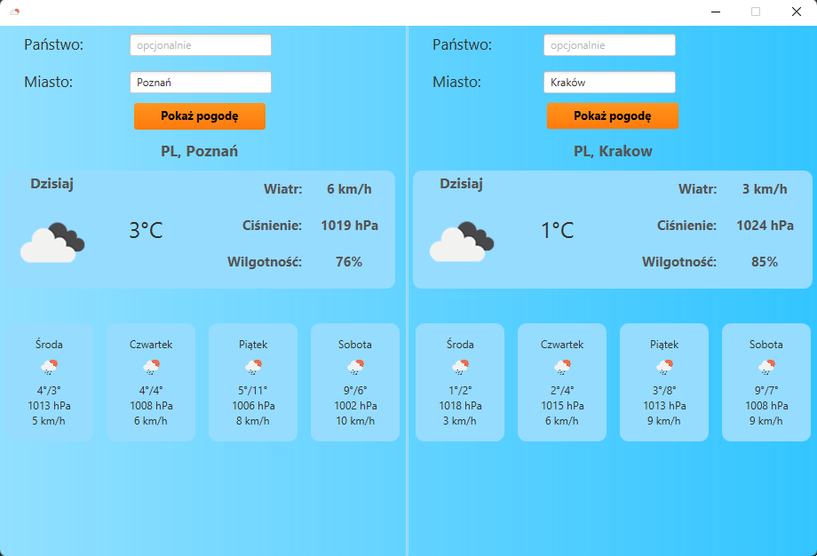
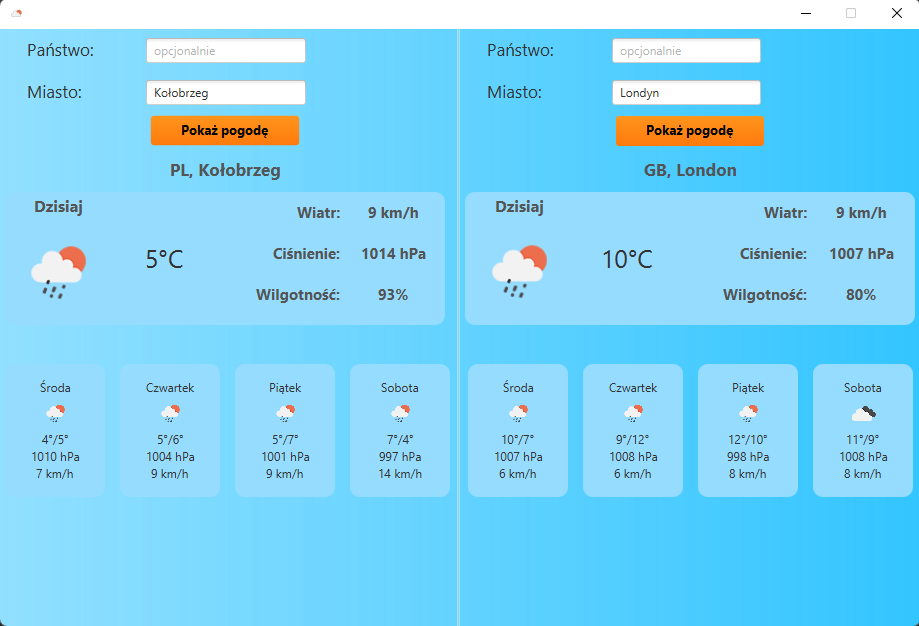
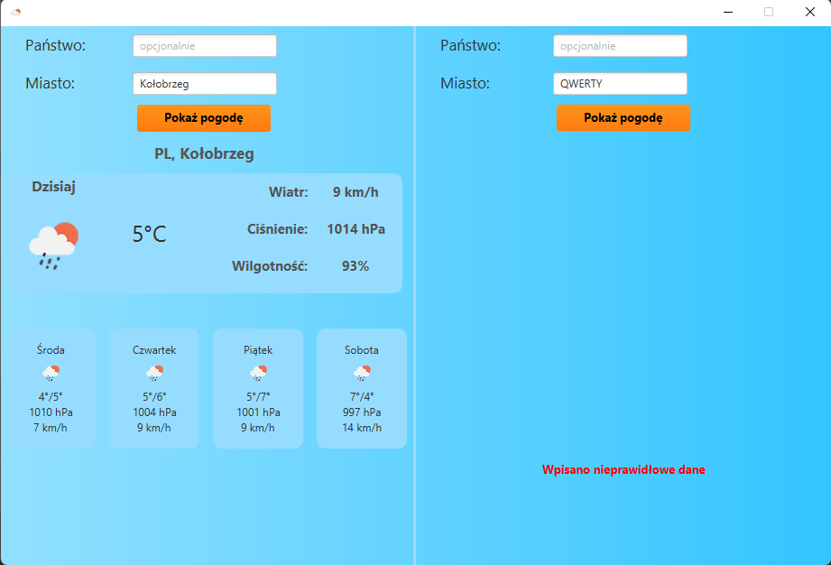

# WeatherForecast
<h3>PL</h3>
<b>aplikacja desktopowa napisana w Javie z użyciem JavaFX oraz biblioteki json, która
umożliwia użytkownikom sprawdzenie prognozy pogody na najbliższe 5 dni dla dwóch
miast jednocześnie. Aplikacja korzysta z api OpenWeatherMap. Dzięki łatwemu w
obsłudze interfejsowi użytkownicy mogą szybko sprawdzić, jaka pogoda czeka ich w
najbliższych dniach.</b>

<b>Technologia:
- JAVA
- JAVAFX
- JUNIT
- MOCKITO
- JSON
</b>

<h3>ENG</h3>
<b>A desktop application written in Java using JavaFX and the JSON library,
which allows users to check the weather forecast for the next 5 days for two cities simultaneously.
The application uses the OpenWeatherMap API. Thanks to the user-friendly interface,
users can quickly check what weather awaits them in the coming days.</b>

<b>Technology:
- JAVA
- JAVAFX
- JUNIT
- MOCKITO
- JSON
</b>

